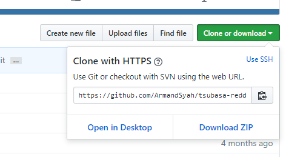

<div></div>

# Tsubasa Reddit Bot

My little pet project, Tsubasa, is a Reddit Bot designed to look up info on an anime (names, source,
synopsis, ect.) for you and display it through a neat and tidy reddit message. 

## Requirements

* Python 3.6
* BeautifulSoup4
* Requests
* PRAW 
* Spice API

## How to Set up Tsubasa on your own

*Make sure you have [Python 3.6](https://www.python.org/downloads/release/python-362/) (**Make Sure you select 'Add 
Python 3.6 to PATH during installation**)  and 
Pip 
installed 
(although 
Pip is usually shipped with the Python download. In case it's not, follow instructions to install Pip 
[here](https://stackoverflow.com/questions/4750806/how-do-i-install-pip-on-windows))*

####Setting up your accounts

1. Click on 'Clone or download' button and then 'Download Zip'. Extract the folder where ever you want

<div></div>

2. Sign up for [MAL Account](https://myanimelist.net/register.php?from=%2F), [AniList](https://anilist.co/register) and
[Reddit](https://www.reddit.com/) accounts if you don't have them already

3. Go into settings folder and open up mal_config.json and type your credentials in their respective places like this:

    ```
        "mal_username": "YourUsername",
        "mal_password": "YourPassword"
    ```
    
   Save afterwords

4. Next, once you're signed into your AniList Account, go to the 
[developer settings](https://anilist.co/settings/developer) and click on 'Create New Api v1 Client'
Here, input any name you want in the field and click 'Save'

<div></img></div>
<div></img></div>

5. Once you've made your AniList client, go to settings folders and open up anilist_config.json. Here take the client ID
and client secret from your AniList client page and place them in the respective place similar to the mal_config.json
. In the 'grant_type' field, type in 'client_credentials' (For more info on this, [go here](http://anilist-api.readthedocs.io/en/latest/authentication.html))

**Warning**: Don't share client ID and client secret with anyone else

6. Next, log in to your reddit account and go to your preferences and then apps. Once there, click 'create another 
app' and write whatever you want for your name and description. Select 'script' radio button. In the redirect uri 
field, type: http://localhost:8080 
You can ignore the about url field

7. Once you've create your application, open up the praw.ini file and input in the field as the following.
In the client_id field, take the string underneath 'personal use script' and paste that in. For the client_secret 
field take the string beside 'secret' on the apps page. Type in your Reddit username and password in the respective 
fields. Put anyting you want in the user_agent field, or leave it empty if you so choose.

<div></img></div>

Now that all the accounts are properly set up, it's time to set up the bot

#### Setting up the bot

1. Run the Command Line inside the 'tsubasa-reddit-bot-master' folder and type this command

    ```
    pip install -r requirements.txt
    ```
    To install all the requirements needed for this bot

2. Finally, type this command in the command line

    ```
    python run.py
    ```
    And now your bot should be running. If it is, then you should see this message
    
    ```
    Authenticating
    Authenticated as KieranBot
    Parsing
    ```

3. Now that your bot is running, send a message to the reddit user you specified in your praw.ini file. 
 Type a name of an anime to the body like this:

    ```
    >Name of anime
    ```
    
    And it should respond back with the proper anime info. 
    
    Let me know if something went wrong and I'll try my best to help.